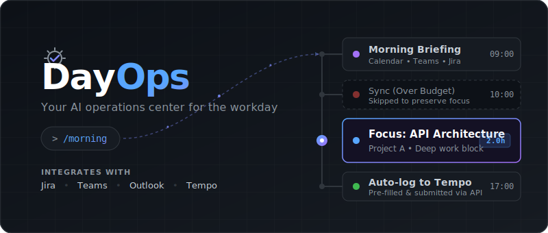

<p align="center">
  
</p>

# DayOps

Your AI operations center for the workday. Manages meetings, tasks, communications, and time logging so you can focus on actual work.

Built for AI coding agents — works with [Claude Code](https://marketplace.visualstudio.com/items?itemName=anthropic.claude-code) and [OpenAI Codex](https://openai.com/index/codex/). Type `/morning` and get your day planned.

## What it does

**Monthly:** Analyzes your ceremony overhead per project. "Your 15% project has 93% of time in meetings — you have 1.8h of actual work left."

**Daily:** Reads your calendar, Teams chats, email, and Jira tickets. Produces a prioritized day plan with meeting decisions, focus blocks, and a pre-filled worklog.

**Live:** Hourly Teams polling flags messages that need your attention. Creates To Do tasks automatically.

## Quick Start

### Claude Code
1. Install [VS Code](https://code.visualstudio.com/) + [Claude Code extension](https://marketplace.visualstudio.com/items?itemName=anthropic.claude-code)
2. Clone this repo and open it in VS Code
3. Start a conversation — approve the Playwright MCP server when prompted (pre-configured in `.mcp.json`)
4. Type `/onboard` on first run, then `/morning` each day

### OpenAI Codex
1. Install [Codex CLI](https://github.com/openai/codex)
2. Clone this repo
3. Run `codex` — Playwright MCP is pre-configured in `.codex/config.toml`
4. Ask it to run the morning briefing (see `AGENTS.md` for workflow)

Playwright MCP is pre-configured for both agents. Atlassian (Jira) is built into Claude Code — just connect when prompted. For Codex, the workspace `.codex/config.toml` includes Atlassian Rovo MCP via `mcp-remote` to `https://mcp.atlassian.com/v1/mcp`; complete the Atlassian auth flow on first use.

## Commands

| Command | What it does |
|---------|-------------|
| `/morning` | Morning briefing — calendar, Jira, email, Teams, worklog template |
| `/month-plan` | Monthly ceremony overhead analysis |
| `/onboard` | Set up or update your profile |
| `/check` | Quick check — only speaks up if something changed |

## Example Morning Briefing

```
## Monday 14 April — Daily Plan

### TL;DR — Your Day in 3 Lines
1. Reply to Bob — he's blocked (5min)
2. Afternoon: API architecture design (2h focus block)
3. Meetings: 2.3h / 2.5h budget. Skip optional discussion to get under.

### Meetings (2.3h occupied, budget 2.5h)
| Time  | Meeting              | Verdict            |
|-------|----------------------|--------------------|
| 09:40 | Daily standup        | ATTEND (transport) |
| 10:00 | Optional discussion  | SKIP (over budget) |
| 13:00 | Architecture sync    | ATTEND             |

### Morning Warm-Up
| # | Item                    | Est.  | Type    |
|---|-------------------------|-------|---------|
| 1 | Reply to Bob            | 5min  | Unblock |
| 2 | Review 2 merge requests | 10min | Review  |
| 3 | Check refinement board  | 5min  | Prep    |

### Afternoon Focus
| Time        | Task                           | Project   |
|-------------|--------------------------------|-----------|
| 13:30-17:00 | API Architecture (Critical)    | Project A |
```

## Key Concepts

- **Meeting budget** (default 2.5h/day) — flags overruns, suggests what to skip
- **Energy-aware scheduling** — mornings for comms/quick tasks, afternoons for deep work (configurable)
- **Standup attendance by allocation** — 50% project = daily, 15% = 2x/week, <5% = async only
- **Delegation decision tree** — DO NOW / SCHEDULE / DELEGATE / AUTOMATE / IGNORE / TODO
- **Calendar-aware** — no fixed template, reads your actual calendar every day
- **Auto time logging** — pre-fills Tempo worklogs, logs directly via API

## Data Sources

| Source | Windows | Mac/Linux | Setup |
|--------|---------|-----------|-------|
| **Calendar** | Outlook COM | Outlook REST API | Automatic — COM on Windows, Playwright token on Mac/Linux |
| **Email** | Outlook COM | Outlook REST API | Automatic — same as calendar |
| **Jira** | Atlassian MCP | Atlassian MCP | Built-in Claude Code integration |
| **Teams chats** | Playwright | Playwright | Zero setup — uses your browser session |
| **Microsoft To Do** | Playwright | Playwright | Zero setup |
| **Tempo worklogs** | Playwright | Playwright | Zero setup |

All Playwright-based sources use token capture from your logged-in browser session — no Azure admin consent, no API keys, no app registration needed. See [setup guide](docs/setup-guide.md) for details.

## Architecture Decisions

| ADR | Decision |
|-----|----------|
| [001](docs/adrs/001-meeting-budget-2.5h.md) | Meeting budget of 2.5h/day — Microsoft EEG research + deep work science |
| [002](docs/adrs/002-delegation-decision-tree.md) | 6-outcome delegation tree — GTD + Eisenhower + LLM reasoning |
| [003](docs/adrs/003-energy-aware-scheduling.md) | Energy-aware scheduling — no fixed template, trust user's chronotype |
| [004](docs/adrs/004-standup-attendance-vs-allocation.md) | Standup frequency matched to project allocation % |
| [005](docs/adrs/005-playwright-over-entra-app.md) | Playwright token capture for zero-setup Teams/To Do/Tempo |
| [006](docs/adrs/006-external-chats-via-dom-discovery.md) | External chat IDs via DOM sidebar discovery |
| [007](docs/adrs/007-prompt-injection-defense.md) | Prompt injection defense — content tagging + lazy tokens + human confirmation |
| [008](docs/adrs/008-email-triage-subagent.md) | Email triage subagent — dual-LLM defense, main agent never sees raw email content |

## Requirements

- [VS Code](https://code.visualstudio.com/) with [Claude Code extension](https://marketplace.visualstudio.com/items?itemName=anthropic.claude-code)
- Python 3.10+
- Node.js 18+
- Windows: Outlook desktop app (for COM access — zero setup)
- Mac/Linux: Playwright browser (`npx playwright install chromium` on first run)

Playwright MCP is pre-configured in `.mcp.json` — Claude Code prompts you to approve it on first open. The onboarding process (`/onboard`) detects your platform and walks you through everything else.

## License

MIT
